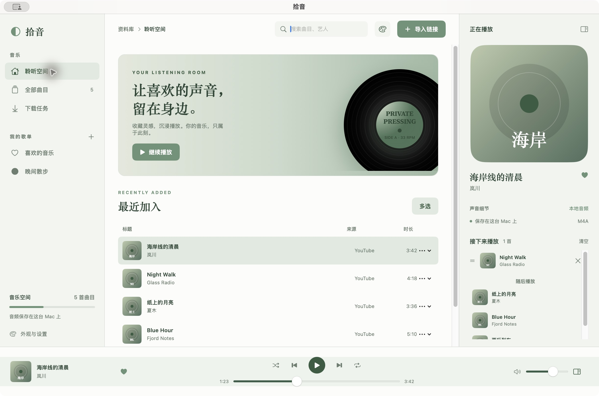
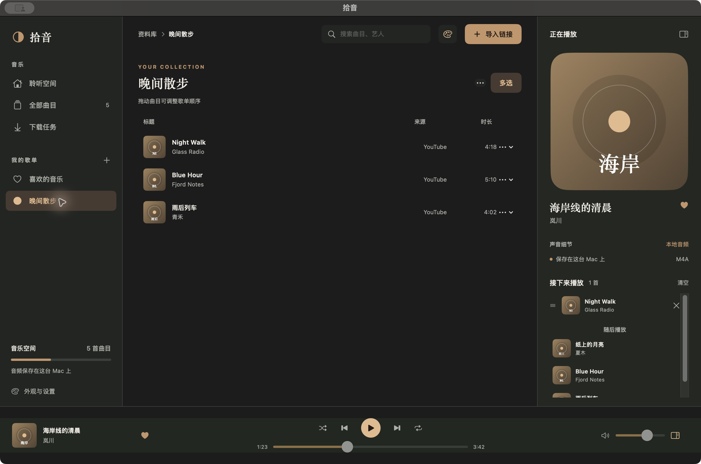
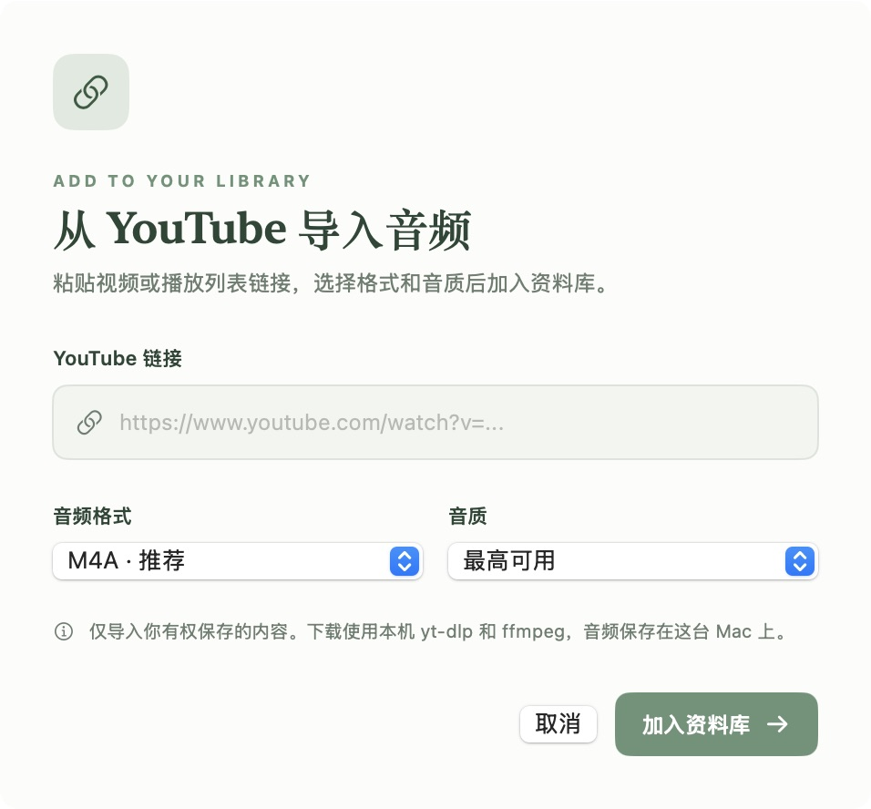

# Shiyin (拾音)

[简体中文](README.md) · [English](README.en.md)

Shiyin is a native SwiftUI music player for macOS. Paste a YouTube or Bilibili video, audio, or list URL, extract audio with [yt-dlp](https://github.com/yt-dlp/yt-dlp) and [FFmpeg](https://ffmpeg.org/), then organize and play the downloaded files locally.

## Screenshots

These screenshots use sample tracks, not a personal music library.

### Listening room · Morning Records



### Custom playlist · Night Vinyl



### Import an audio link



## Features

- **Choose what to import:** Import YouTube videos and playlists, or Bilibili BV/av videos, multipart videos, audio, collections, favorites lists, and audio albums. Preview a list and select all, none, or individual items. Choose M4A or MP3 and an audio quality setting.
- **Manage downloads:** Track progress, cancel or retry downloads, and copy error messages. Unfinished tasks are queued again when the app restarts.
- **Play locally:** Search your library, reorder the play queue, shuffle, repeat a playlist, or repeat one track. The app restores the last track, position, queue, and volume after a restart, but stays paused.
- **Use macOS controls:** Playback continues when the main window is minimized or closed. Control it from the menu bar or macOS media controls.
- **Organize your library:** Favorite tracks and create playlists. When removing a track, keep its audio file or move the file to the Trash.
- **Change the appearance:** Switch between four color themes: Morning Records, Night Vinyl, Deep Sea Radio, and Vintage Studio.
- **Launch intro:** A short record animation and chime play when the app opens. You can skip the animation or turn off the sound in Settings.

## Requirements

- macOS 14 or later
- A Swift 6 toolchain (Xcode or Xcode Command Line Tools) to build from source
- Local `yt-dlp` and `ffmpeg` for a normal development build; Deno is recommended
- No separate tool installation for an app bundle built with bundled tools

The minimum macOS version of a bundled app depends on its tools and is written into the app bundle during packaging. The static LAME and mpg123 libraries on the current build Mac require macOS 15.

With Homebrew, install the command-line dependencies using:

```bash
brew install yt-dlp ffmpeg deno
```

## Run from source

From the repository root, run:

```bash
./script/build_and_run.sh
```

The script builds the SwiftPM project, creates `dist/Shiyin.app`, and launches it. It uses an ad hoc local signature for development; this repository does not currently provide a notarized release. Running the script closes any existing Shiyin process before rebuilding.

## Build an app with bundled tools

Place four standalone macOS executables for the same target architecture in one directory, named `yt-dlp`, `ffmpeg`, `ffprobe`, and `deno`. Then run:

```bash
./script/build_app.sh --tools-dir /path/to/portable-tools
```

The resulting `dist/Shiyin.app` contains them in `Contents/MacOS/Tools` and uses them before system tools. A user-selected yt-dlp path in Settings takes precedence. The build rejects tools that still link to Homebrew or other non-system libraries; copying the executable from `brew install ffmpeg` is therefore insufficient. See [bundled tool notes](docs/bundled-tools.md) for sources, licenses, and release checks. With a Developer ID certificate, add `--sign-identity "Developer ID Application: ..."`; public distribution also requires notarization.

The repository includes `script/fetch_release_tools.sh` to download and verify official yt-dlp and Deno releases, and `script/build_portable_ffmpeg.sh` to build standalone `ffmpeg` and `ffprobe` from FFmpeg source and static LAME and mpg123 libraries on the build Mac; see the bundled tool notes for the commands.

## How to use

1. Click **Import Link** (导入链接) and paste a YouTube or Bilibili URL. A Bilibili BV link downloads its current part by default; select **Import all parts** (导入全部分 P) to preview every part.
2. For a playlist, collection, or favorites list, preview and select the items you want. Choose the format, quality, and download location.
3. Play downloaded tracks from your library or playlists, add them to the play queue, or control playback from the menu bar.

Audio files are saved to `~/Music/拾音` by default. You can change the location for future downloads in Settings. Library data is stored in `~/Library/Application Support/Shiyin/library.json`.

### If YouTube asks you to sign in

If yt-dlp reports `Sign in to confirm you’re not a bot`, open **Appearance & Settings** (外观与设置), choose browser cookies or a `cookies.txt` file if needed, then retry the download. The app does not read login information by default. Cookies may contain login credentials; do not commit or share them. See the [yt-dlp cookie FAQ](https://github.com/yt-dlp/yt-dlp/wiki/FAQ#how-do-i-pass-cookies-to-yt-dlp) for details.

Some playlists require authentication or are marked unviewable by YouTube, so they may not import. Download support can also change as YouTube and yt-dlp evolve. If extraction fails, try updating yt-dlp.

Bilibili authentication is configured separately in Settings and does not use browser cookies by default. Private favorites lists require the corresponding account. To show titles, the app reads each Bilibili list item's metadata, so large collections can take time; close the import dialog to cancel.

## Development and tests

```bash
./script/test.sh
```

This script runs checks for core behavior, authentication arguments, playlists and the play queue, and playback logic. App code is in `Sources/Shiyin/`; build scripts are in `script/`.

## Use responsibly

Only download and use content you have the right to save. This project is not affiliated with YouTube, Bilibili, or Apple Music.

## License

The project code and original assets are available under the [MIT License](LICENSE). Bundled third-party tools such as yt-dlp, FFmpeg, and Deno retain their own licenses; see the [bundled tool notes](docs/bundled-tools.md).
